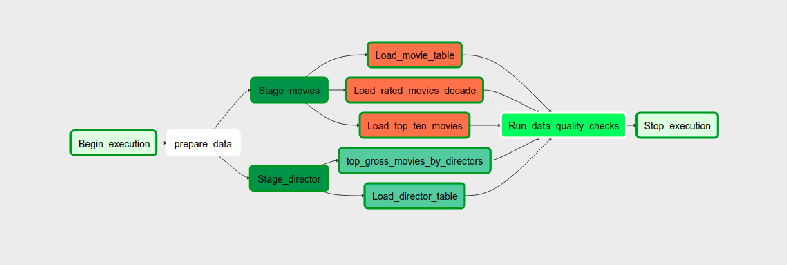
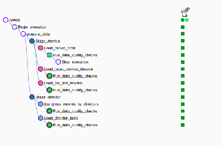

# imdb-etl-pipeline

In this project movies dataset will be used to to ETL job and is stored on AWS S3. ETL jobs are written in spark and scheduled in airflow to run every 1 hour.

# ETL Flow

* Raw data is stored on s3 bucket.
* Once the data is available on the input directory, a spark job is triggered and processed data is stored in another bucket.
* An ETL job picks up data from processed zone and stages it into the Redshift staging tables.
* Using the Redshift staging tables data is loaded into destination tables.
* ETL job execution is completed once the Data Warehouse is updated.
* Airflow DAG runs the data quality check on all Warehouse tables once the ETL job execution is completed.
* Dag execution completes after these Data Quality check.

# Environment Setup

<b>Hardware suggetion </b>  
EMR :

    m5.xlarge
    4 vCore, 16 GiB memory, EBS only storage
    EBS Storage:64 GiB
    
Redshift:   

    Redshift 2 Node cluster with Instance Types `dc2.large`  
    
## Execute

1. Install Airflow, create variable AIRFLOW_HOME and AIRFLOW_CONFIG with the appropiate paths, and place dags and plugins on airflor_home directory.
2. Initialize Airflow data base with airflow initdb, and open webserver with airflow webserver
Access the server http://localhost:8080 
3. Create AWS Connection & Redshift Connection as follows

**AWS Connection**  
<b>Conn Id :</b> Enter aws_credentials.  
<b>Conn Type :</b> Enter Amazon Web Services.  
<b>Login :</b> Enter your Access key ID from the IAM User credentials you downloaded earlier.  
<b>Password :</b> Enter your Secret access key from the IAM User credentials you downloaded earlier.   

**Redshift Connection**  
<b>Conn Id :</b> Enter redshift.  
<b>Conn Type :</b> Enter Postgres.  
<b>Host :</b> Enter the endpoint of your Redshift cluster, excluding the port at the end.   
<b>Schema :</b> This is the Redshift database you want to connect to.  
<b>Login :</b> Enter awsuser.  
<b>Password :</b> Enter the password created when launching the Redshift cluster.  
<b>Port :</b> Enter 5439.  

* Task dependencies are set as following:

## Scenarios

-   Data increase by 100x. read > write. write > read
    
    -   Redshift: Analytical database, optimized for aggregation, also good performance for read-heavy workloads
    -   Increase EMR cluster size to handle bigger volume of data

-   Pipelines would be run on 7am daily. would it still work?
    
    -   DAG is scheduled to run every 1 hour and can be configured to run every morning at 7 AM if required. 
    
-   Make it available to 100+ people
    -   We can set the concurrency limit for your Amazon Redshift cluster. While the concurrency limit is 50 parallel queries for a single period of time, this is on a per cluster basis, meaning you can launch as many clusters as fit for you business.
 
